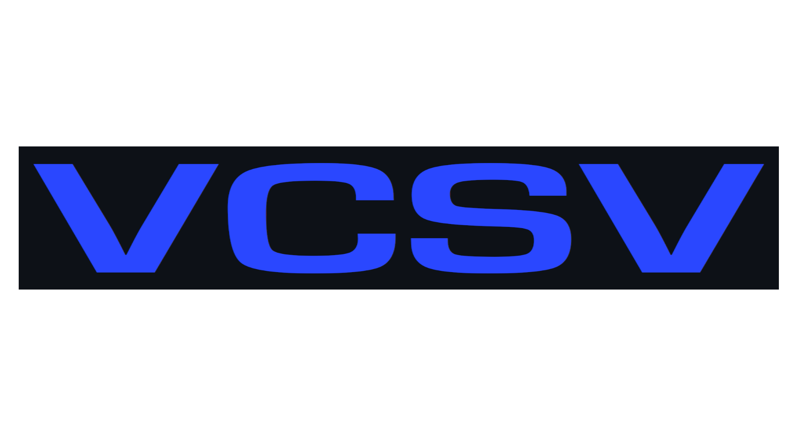

# VCSV

  

VCSV is a Java library that helps analyze data in CSV files along with the <a href="https://captmd-11.github.io/blog/vstats/" target="_blank">VStats</a> statistics library. 

 

<a href="https://captmd-11.github.io/blog/vcsv/" target="_blank">Download VCSV JAR</a>

 

## Importing into Projects 

Instructions on how to install & import VCSV into Java projects are available <a target="_blank" href="https://captmd-11.github.io/blog/misc_instructions/howtoimportjavalibrary.html">here</a>. 

## How to use VCSV? 

As mentioned above, this library is meant to be used with VStats. With VCSV, users can easily convert data into arrays, which can then be inputted into VStats functions. 

All the methods in VCSV are <samp>static</samp>, so they can be called without creating VCSV objects. This works similar to the Java Math library. 

## Documentation 

Java documentation for VCSV is available <a target="_blank" href="https://captmd-11.github.io/blog/vcsv/VCSVHTML/VCSV.html">here</a>. 

## Version History

### v1.0
- RELEASE

## License 

The VCSV library is protected by the <a href="https://github.com/CaptMD-11/VCSV/blob/master/LICENSE.txt" target="_blank">GNU GPL</a> license. 
